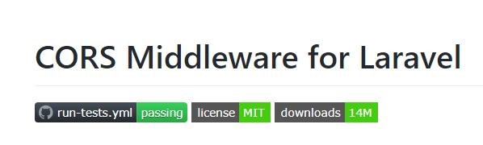

### Prerequisitos
 
* Apache web server 
* mod_rewrite enabled
* PHP 7.3.26
* Composer
* MySQL 5+
* Libreria GD 
* Multibyte String support (for internationalization)
* Libreria XML

## Instalacion

* Clonar este repositorio
* Crear una base de datos en limpio
* Con la consola de comandos (CLI), ir a la carpeta root del sistema y ejecutar el comando ``` composer install ```
* Cambiar los parametros de la base de datos en el archivo ``` .env ``` (Si no existe un archivo .env, copiar el archivo .env.example)
* Cambiar los permisos de la carpeta ``` storage ```
* Usar el CLI y ejecutar el siguiente comando: ``` php artisan key:generate ```
* Luego, con el CLI ejecutar el siguiente comando: ```  php artisan view:clear ``` y tambien el comando ``` php artisan cache:clear ```
* Para generar el esquema de la base de datos del sistema, ejecute el comando: ``` php artisan migrate ``` 

## Paquetes requeridos

<p align="center"></p>

<p align="center"></p>

<p align="center"></p>


## Informacion Adicional

Creado con:

<p align="center"><a href="https://laravel.com" target="_blank"></a></p>

<p align="center">
<a href="https://travis-ci.org/laravel/framework"></a>
<a href="https://packagist.org/packages/laravel/framework"></a>
<a href="https://packagist.org/packages/laravel/framework"></a>
<a href="https://packagist.org/packages/laravel/framework"></a>
</p>

<b>Version 8.25.0</b>